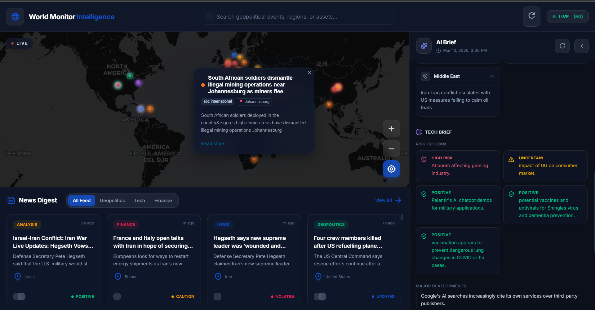

<div align="center">

# WORLD MONITOR INTELLIGENCE

### Real-Time Global Situational Awareness Platform

[](https://fastapi.tiangolo.com/)
[](https://react.dev/)
[](https://www.postgresql.org/)
[](https://ollama.com/)
[](https://www.typescriptlang.org/)
[](https://www.python.org/)

---

**Aggregate** global news feeds | **Visualize** events on an interactive map | **Generate** AI-powered intelligence briefs

*One screen. Every headline. Full context.*

**Live URL:** https://worldmonitor.sirthabet.dev/

</div>

---

<p align="center">
  
</p>

---

## Table of Contents

- [Overview](#overview)
- [Key Capabilities](#key-capabilities)
- [Tech Stack](#tech-stack)
- [Getting Started](#getting-started)
- [Documentation](#documentation)
- [API Reference](#api-reference)
- [Operations](#operations)

---

## Overview

**World Monitor Intelligence** is a production-grade situational awareness dashboard that fuses three intelligence functions into a single interface:

1. **News Aggregation** — Continuously ingests and normalizes headlines from 10+ trusted RSS sources spanning geopolitics, finance, conflict, and technology.
2. **Geographic Event Mapping** — Extracts locations using NLP (spaCy NER) and geocoding (Nominatim), then plots events on a live interactive map.
3. **AI-Powered Briefings** — Synthesizes headlines into structured **World Briefs** and **Tech Briefs** using a locally-hosted LLM via Ollama, with automatic refresh every 30 minutes.

## Key Capabilities

| Capability | Details |
|:-----------|:--------|
| **News Digest Engine** | 10+ RSS feeds (BBC, CNN, NYT, Guardian, TechCrunch, Wired) across Geopolitics, Finance, and Tech with automatic deduplication |
| **Interactive World Map** | Live geospatial plotting via spaCy NER location extraction and Nominatim geocoding with persistent cache |
| **AI Intelligence Briefs** | LLaMA 3.2 via Ollama (100% local) — structured World Brief and Tech Brief regenerated every 30 minutes via APScheduler |
| **Risk Signal Indicators** | Per-article classification: **HIGH RISK** / **POSITIVE** / **UNCERTAIN** / **VOLATILE** with regional rollup in the brief panel |

---

## Tech Stack

| Layer | Technology | Purpose |
|:------|:-----------|:--------|
| **Frontend** | React 19, TypeScript, Vite 7 | Single-page dashboard with panels, filters, and map |
| **Backend** | Python 3.11, FastAPI | REST API for digest, map, and brief endpoints |
| **Database** | PostgreSQL 16 | Persistent storage for articles and briefs |
| **AI / LLM** | Ollama, LLaMA 3.2, LangChain | Local AI brief generation with structured JSON output |
| **NLP** | spaCy `en_core_web_sm` | Named entity recognition for location extraction |
| **Geocoding** | Nominatim (via geopy) | Coordinate resolution with persistent JSON cache |
| **Scheduling** | APScheduler 3.11 | Embedded interval scheduler inside FastAPI — runs the RSS + AI brief pipeline every 30 min |
| **Runtime** | Docker Compose, Nginx | Multi-container local stack with reverse proxy for API |

---

## Getting Started

### Prerequisites

- [Docker](https://www.docker.com/) and Docker Compose v2
- [Node.js](https://nodejs.org/) 22+
- [pnpm](https://pnpm.io/) 9+

### 1 &mdash; Clone the Repository

```bash
git clone https://github.com/your-org/world-monitor.git
cd world-monitor
```

### 2 &mdash; Configure Environment

```bash
cd backend
cp .env.example .env
# Edit backend/.env if needed
```

### 3 &mdash; Start the Stack

```bash
cd backend
docker compose up -d
```

| Service | URL |
|:--------|:----|
| API (via Nginx) | http://localhost:8080 |
| API Docs (via Nginx, dev only) | http://localhost:8080/docs |
| FastAPI (direct container port) | http://localhost:8000 |
| Ollama | http://localhost:11434 |

In production, `/docs`, `/redoc`, and `/openapi.json` are disabled (see [API Reference](#api-reference)).

> The Ollama container pulls `llama3.2` automatically on first start.

### 4 &mdash; Start Frontend

```bash
cd ../frontend
pnpm install
pnpm dev
```

Frontend runs at `http://localhost:5173` and proxies `/api` requests to `http://localhost:8000` in development.

### 5 &mdash; Verify the Stack

```bash
# Fetch latest news
curl http://localhost:8080/api/news

# Fetch latest AI briefs
curl http://localhost:8080/api/ai-briefs
```

---

## Documentation

### System Architecture

| Document | Description |
|:---------|:------------|
| [System Overview](docs/system-arch/system-overview.md) | Project vision, goals, and MVP scope |
| [Architecture](docs/system-arch/architecture.md) | System context, container, and component diagrams with service interactions and data flow |
| [Database Schema](docs/system-arch/database.md) | Entity model, constraints, indexes, and ingest strategy |
| [Observability](docs/system-arch/observability.md) | Prometheus metrics, Grafana dashboards, and PromQL queries |

### System Components

| Document | Description |
|:---------|:------------|
| [News RSS Pipeline](docs/system-components/news-pipeline.md) | RSS ingestion lifecycle: fetch, parse, normalize, enrich, and persist |
| [News API Flow](docs/system-components/news-api-flow.md) | Endpoint orchestration for `GET /api/news`, `GET /api/map`, and AI brief APIs |
| [AI Brief Service](docs/system-components/ai-brief-service.md) | LLM prompt design, article selection, and structured output |
| [Location Caching Strategy](docs/system-components/location-caching-strategy.md) | Geocode cache design, rate-limit mitigation, and cache data shape |
| [Scheduled Tasks](docs/system-components/scheduled-tasks.md) | APScheduler interval job: sequential RSS ingestion → AI brief generation every 30 minutes |

### DevOps & Operations

| Document | Description |
|:---------|:------------|
| [Deployment Architecture](docs/deployment/deployment-architecture.md) | VPS + Dokploy topology, domains, and service boundaries |
| [Dokploy CI/CD Flow](docs/deployment/dokploy-cicd-flow.md) | Automatic deployment flow triggered by push to `main` |
| [Observability Runbook](docs/deployment/observability-runbook.md) | Dokploy metrics monitoring + Better Stack log tracing workflow |

---

## API Reference

Postman Collection:
- [World Monitor API Collection](docs/postman/world-monitor-api.postman_collection.json)


### Base URLs
- Production API: `https://api-worldmonitor.sirthabet.dev`
- Local API via Nginx: `http://localhost:8080`
- Local FastAPI direct port: `http://localhost:8000`

| Method | Endpoint | Description |
|:-------|:---------|:------------|
| `GET` | `/` | Health check (`{"message": "API is running"}`) |
| `GET` | `/api/news` | Retrieve latest cached news articles |
| `GET` | `/api/map` | Retrieve latest geocoded news for map markers |
| `GET` | `/api/ai-briefs` | Get latest AI-generated World & Tech briefs |

**Development-only docs endpoints:** When `APP_APP_ENV=production`, these are disabled: `/docs` (Swagger UI), `/redoc` (ReDoc), and `/openapi.json`. In development they are available (for example `http://localhost:8080/docs`).

### Quick API Checks

```bash
curl https://api-worldmonitor.sirthabet.dev/
curl https://api-worldmonitor.sirthabet.dev/api/news
curl https://api-worldmonitor.sirthabet.dev/api/map
curl https://api-worldmonitor.sirthabet.dev/api/ai-briefs
```

---

## Operations

Current runtime behavior:
- FastAPI serves API endpoints and starts APScheduler in-process.
- APScheduler runs the world monitor pipeline every 30 minutes.
- Nginx proxies backend traffic on port `8080`.
- PostgreSQL stores `news` and `briefs` records.
- Ollama serves `llama3.2` for brief generation.

Operational docs:
- [Deployment Architecture](docs/deployment/deployment-architecture.md)
- [Dokploy CI/CD Flow](docs/deployment/dokploy-cicd-flow.md)
- [Observability Documentation](docs/system-arch/observability.md)

---

<div align="center">

**World Monitor Intelligence** &mdash; Built for global awareness.

*Turning noise into signal, one headline at a time.*

</div>
