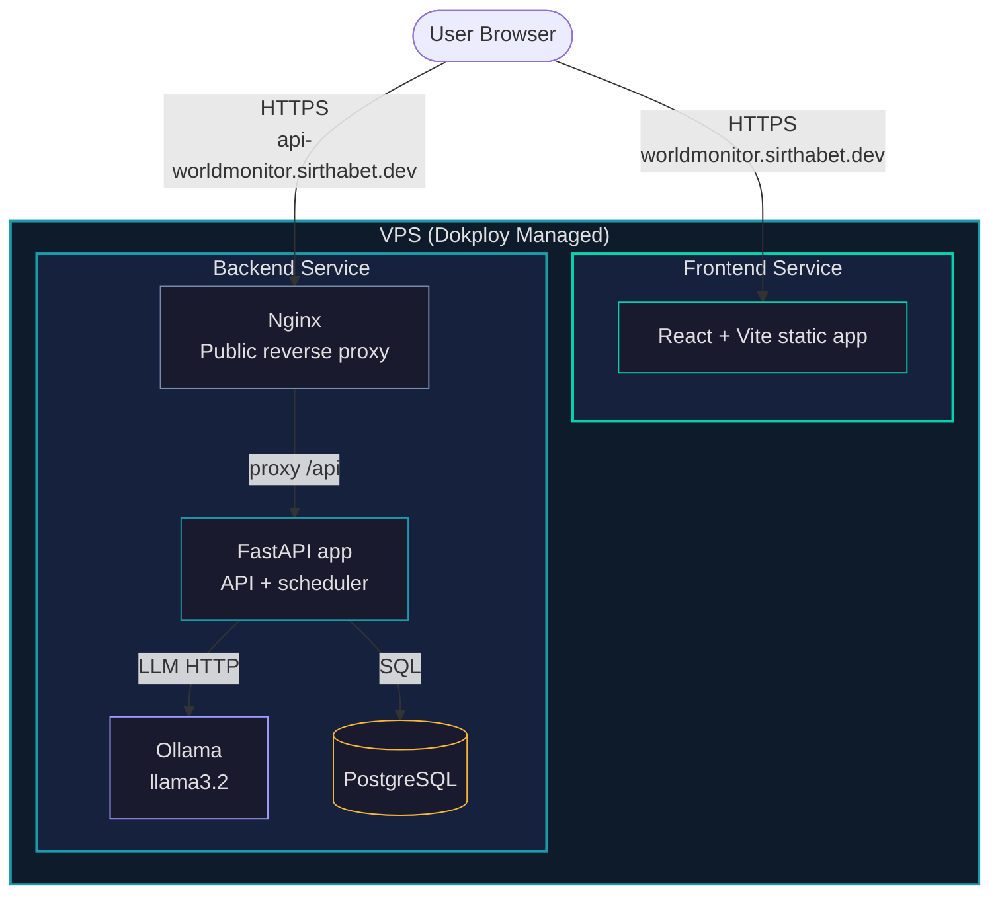

# Deployment Architecture

## Purpose
This document describes how World Monitor is deployed on a VPS and managed through Dokploy, including service boundaries, domains, and runtime networking.

## Deployment Model
The production setup uses one VPS with Dokploy managing two services:

- `frontend` service: React dashboard
- `backend` service: FastAPI, Nginx reverse proxy, Ollama, and PostgreSQL (managed from the backend stack)

## Public Domains

| Domain | Service | Role |
|:-------|:--------|:-----|
| `https://worldmonitor.sirthabet.dev/` | Frontend service | Public dashboard UI |
| `https://api-worldmonitor.sirthabet.dev/` | Backend service | Public API entry point via Nginx |

## Container Topology

## Runtime Notes
- The backend Docker stack is defined in `backend/docker-compose.yml`.
- Nginx is the public edge inside the backend stack and proxies requests to FastAPI.
- FastAPI runs API routes and background scheduling for the RSS + AI brief pipeline.
- FastAPI connects to PostgreSQL for persistence and Ollama for local LLM inference.

## Sensitive URLs in Production
When `APP_APP_ENV=production`, FastAPI **disables** interactive docs and the OpenAPI schema to avoid exposing API structure and internals:
- `/docs` (Swagger UI) — **disabled**
- `/redoc` (ReDoc) — **disabled**
- `/openapi.json` — **disabled**

Set `APP_APP_ENV=production` in the backend service environment in Dokploy (or in `docker-compose` env for production). In development, leave it as `development` (default) to keep docs available at e.g. `http://localhost:8080/docs`.

## Dokploy Responsibilities
- Build and run each service from its repository path.
- Attach each service to its assigned domain.
- Keep service health and restart policy active.
- Provide deployment history and logs per service.

## Related Docs
- [Architecture](../system-arch/architecture.md)
- [Scheduled Tasks](../system-components/scheduled-tasks.md)
