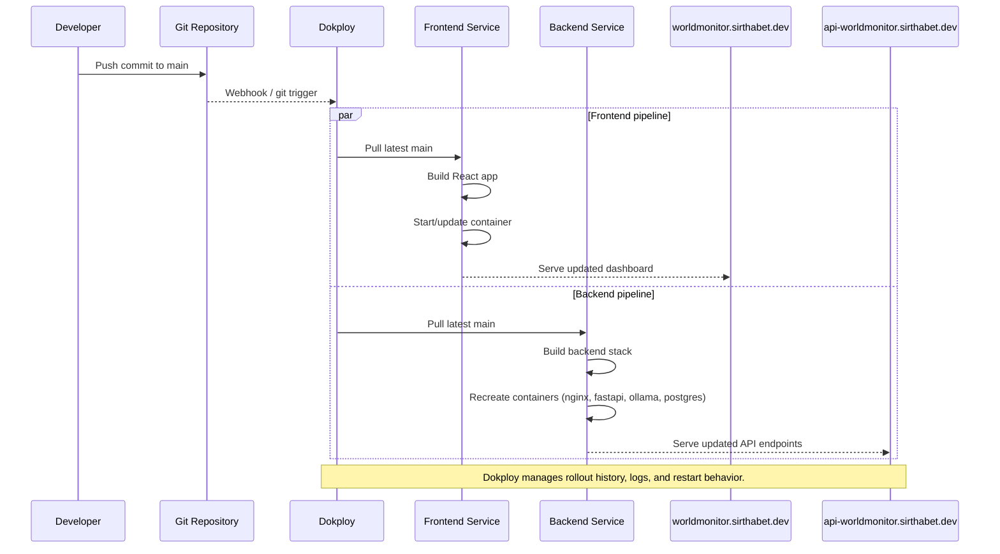

# Dokploy CI/CD Flow

## Purpose
This document describes the production deployment flow in Dokploy when code is pushed to the `main` branch.

## Trigger Strategy
- Frontend service deploys when frontend-related changes are pushed to `main`.
- Backend service deploys when backend-related changes are pushed to `main`.
- Deployments are triggered by Dokploy automation configured per service.

## Deployment Sequence

## What Gets Deployed

| Dokploy Service | Workload |
|:----------------|:---------|
| `frontend` | React frontend container exposed at `worldmonitor.sirthabet.dev` |
| `backend` | Nginx + FastAPI + Ollama + PostgreSQL stack exposed at `api-worldmonitor.sirthabet.dev` |

## Operational Checks After Deploy
1. Open `https://worldmonitor.sirthabet.dev/` and verify dashboard loads.
2. Verify API health: `GET https://api-worldmonitor.sirthabet.dev/` returns `{"message":"API is running"}`. (In production, `/docs` and `/openapi.json` are intentionally disabled; see [Deployment Architecture](deployment-architecture.md#sensitive-urls-in-production).)
3. Verify latest headlines are returned by `GET /api/news`.
4. Confirm AI brief endpoint responds (`GET /api/ai-briefs`).
5. Check Dokploy logs for both services and confirm no failing container restarts.

## Rollback Approach
- Use Dokploy deployment history to redeploy the last known good revision for the affected service.
- Roll back frontend and backend independently when only one service is impacted.
- If backend schema changes are introduced in the future, pair rollback with migration compatibility checks.

## Related Docs
- [Deployment Architecture](deployment-architecture.md)
- [News API Flow](../system-components/news-api-flow.md)
- [AI Brief Service](../system-components/ai-brief-service.md)
