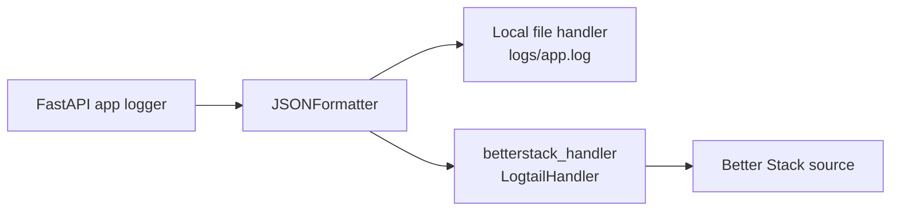

# Observability Runbook

## Purpose
This document explains how to monitor World Monitor in production using:
- **Dokploy Monitor** for service and infrastructure metrics
- **Better Stack (Logtail)** for centralized log tracing

## Monitoring Strategy
The production observability model uses two layers:

| Layer | Tool | Primary Use |
|:------|:-----|:------------|
| Metrics | Dokploy Monitor | Container health, CPU, memory, restart behavior, deploy/runtime stability |
| Logs | Better Stack | Structured application log search, filtering, and incident tracing |

## Log Pipeline

## Current Backend Logging Setup
The backend sends each app log record to two destinations:
1. Local file: `backend/logs/app.log`
2. Better Stack: through Logtail handler

Implementation references:
- Dependency: `backend/requirements.txt` includes `logtail-python==0.3.4`
- Logger config: `backend/config/logger.py`
  - `BETTERSTACK_SOURCE_TOKEN` is hardcoded
  - `betterstack_handler = LogtailHandler(source_token=BETTERSTACK_SOURCE_TOKEN)`
  - Both `file_handler` and `betterstack_handler` use the same JSON formatter

## Using Dokploy Monitor (Metrics)
Use Dokploy as the first stop for runtime health and platform metrics.

### What to watch
- CPU and memory usage trends for the backend service
- Container restarts or crash loops
- Deploy health after new releases
- Service availability and uptime status

### Suggested operational flow
1. Open Dokploy and select the `backend` service.
2. Check Monitor charts for CPU, RAM, and restarts in the incident time window.
3. If a spike/restart is visible, pivot to logs in Better Stack using the same timestamp range.

## Using Better Stack (Log Tracing)
Use Better Stack to trace request-level and job-level events.

### Recommended filters
- `level:error` or `level:warning` for fast triage
- `request_id:<value>` to follow one request end-to-end
- `path:/api/news` (or another endpoint) to isolate route-specific behavior
- `source`, `url`, `entries_count`, `failed_sources` for pipeline diagnostics

### Typical trace workflow
1. Start with a failing endpoint or incident timestamp.
2. Filter by `path` and `level`.
3. Drill into a single `request_id`.
4. Correlate related records (`duration_ms`, `status_code`, exception payload).
5. Confirm whether the issue is app logic, external dependency, or infrastructure.

## Verification Checklist
After deploys or logger changes:

1. Trigger traffic:
   - `GET /`
   - `GET /api/news`
2. Confirm new lines are written in `backend/logs/app.log`.
3. Confirm the same events appear in Better Stack live tail/search.
4. Confirm Dokploy Monitor shows healthy containers and no restart anomalies.

## Incident Triage Order
Use this order to reduce MTTR:
1. **Dokploy Monitor**: detect if issue is infra/resource related.
2. **Better Stack logs**: trace request and exception context.
3. **API functional checks**: verify endpoint behavior after remediation.

## Related Docs
- [Deployment Architecture](deployment-architecture.md)
- [Dokploy CI/CD Flow](dokploy-cicd-flow.md)
- [Observability Implementation](../system-arch/observability.md)
