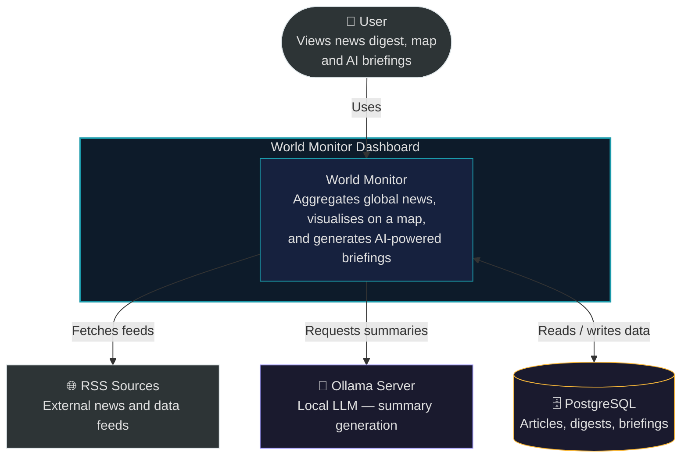
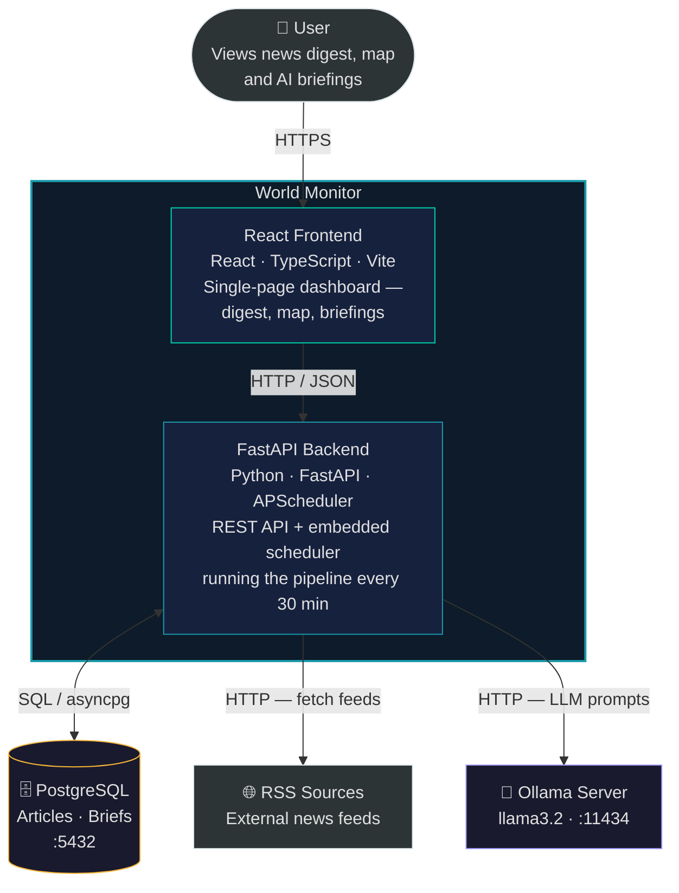
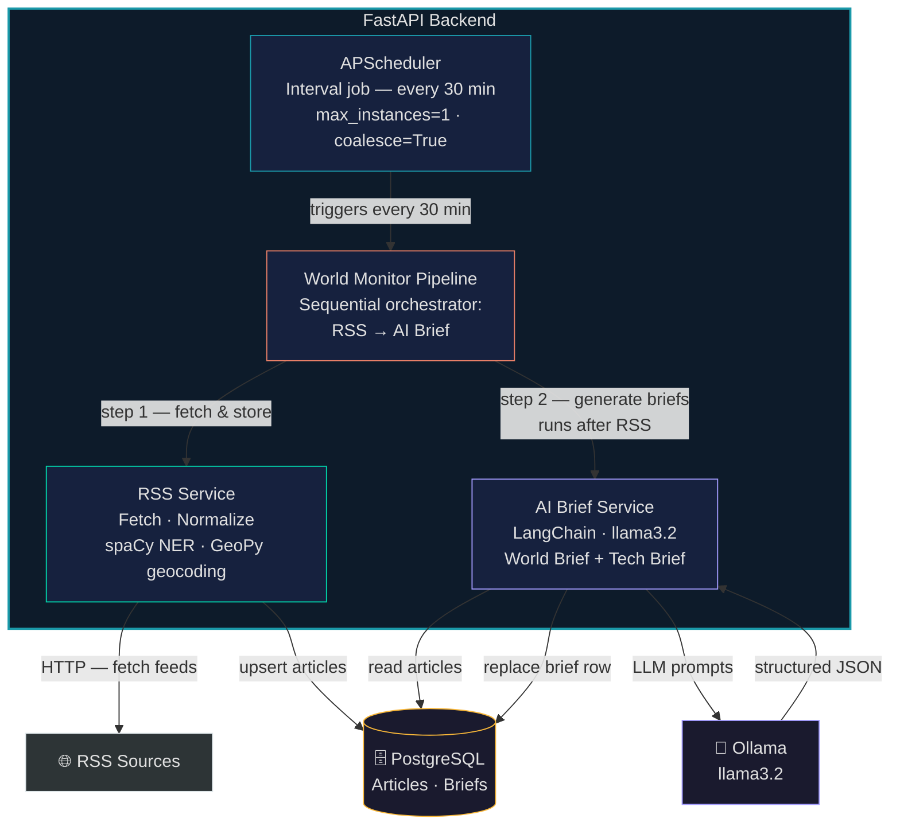
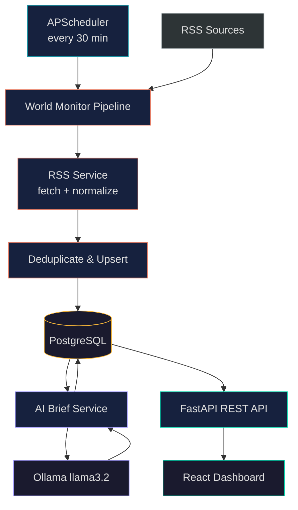

# Architecture
## Level 1: System Context

Who uses the system and what external systems it depends on.

---

## Level 2: Containers

The two deployable units inside World Monitor and how they communicate with each other and external systems.

---

## Level 3: Components

Internal components of the FastAPI backend and their responsibilities.

## Service Interaction
React calls FastAPI for digest, map, and brief endpoints. Inside FastAPI, APScheduler fires the world monitor pipeline every 30 minutes — first fetching and storing RSS articles, then generating AI briefs via Ollama. All data is persisted to PostgreSQL.

## Data Flow

APScheduler triggers the pipeline every 30 minutes: RSS feeds are fetched, normalised, and upserted to PostgreSQL; then the AI Brief Service reads the freshest articles, calls Ollama llama3.2 for structured JSON output, and replaces the brief row. The React dashboard reads all data through the FastAPI REST API.

## Related Documents
- [Scheduled Tasks](../system-components/scheduled-tasks.md)
- [News RSS Pipeline](../system-components/news-pipeline.md)
- [Location Caching Strategy](../system-components/location-caching-strategy.md)
