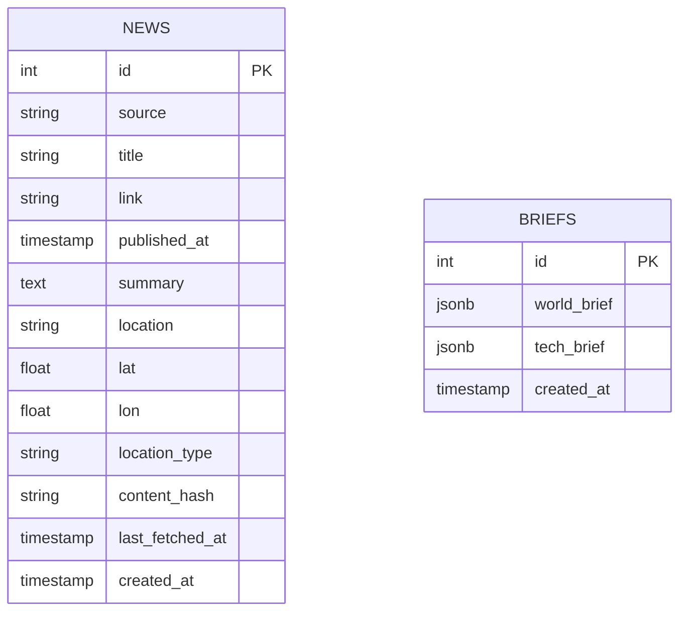

# Database

## Entities
The backend persists aggregated feed data in a `news` table represented by the `News` ORM model.
This table is also used as the application's news cache so clients can read recent news quickly without triggering live RSS fetches on each request.

The AI brief module persists generated summaries in a `briefs` table.
This table stores the latest generated world and tech brief payloads as JSON for dashboard retrieval.

## ER Diagram


## AI Brief Storage Strategy
1. Fetch latest world and tech article batches from `news`.
2. Generate `world_brief` and `tech_brief` through the LLM.
3. Replace previous brief snapshot with new data using one DB transaction.

Example replacement query pattern:

```sql
BEGIN;

DELETE FROM briefs;

INSERT INTO briefs (world_brief, tech_brief)
VALUES (:world_brief_json, :tech_brief_json);

COMMIT;
```

If any write step fails, run `ROLLBACK;`.

## Column Mapping From RSS Pipeline Output
- `source` -> `news.source` (for example `bbc_world`, `cnn_world`)
- `title` -> `news.title`
- `link` -> `news.link`
- `published_at` -> parsed into `news.published_at` timestamp
- `summary` -> `news.summary`
- `location`, `lat`, `lon`, `location_type` -> nullable geo columns in `news`

## Constraints And Indexes
- Unique constraint on `news.link` for data quality.
- Composite index on `news(source, published_at)` for source timelines.
- Index on `news(content_hash)` for fallback dedup/filter operations.
- Index on `news(lat, lon)` for map queries.
- Index on `briefs(created_at)` for latest-brief retrieval.

## Ingest Replacement Strategy
1. Build source set from current ingest payload.
2. Delete existing rows where `news.source` is in that set.
3. Insert new payload rows.
4. If payload is empty, skip delete/insert and keep old rows.

## Deduplication Notes
- `link` remains unique to prevent duplicate inserts inside a single ingest payload.
- `content_hash` is kept as a helper field for diagnostics and future matching.

## Runtime Ownership
- `POST /api/news/ingest` runs RSS fetch + enrichment and performs source-scoped replace into `news`.
- `GET /api/news` reads from `news` only and never fetches RSS directly.
- `last_fetched_at` tracks when a row was last seen during ingest.
- `GET /api/briefs` reads latest brief snapshot from `briefs` (or triggers generation on cache miss).
- `POST /api/briefs/regenerate` generates fresh brief payloads and replaces rows in `briefs`.

## Related Docs
- RSS internals: [../system-components/news-pipeline.md](../system-components/news-pipeline.md)
- API orchestration: [../system-components/news-api-flow.md](../system-components/news-api-flow.md)
- AI brief flow: [../system-components/ai-brief-service.md](../system-components/ai-brief-service.md)
