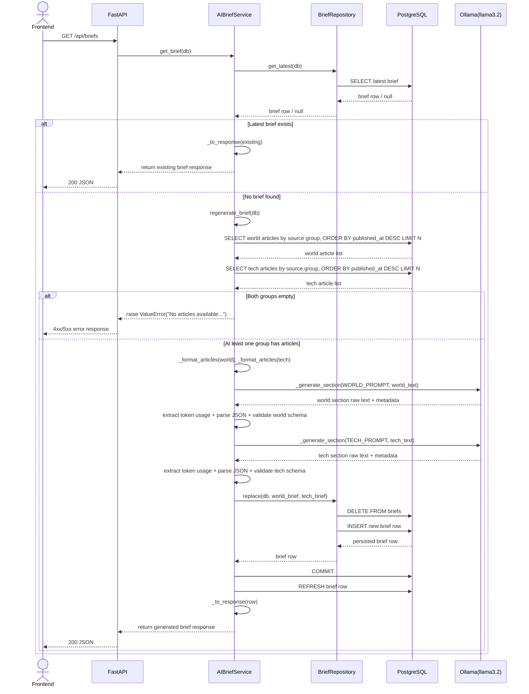
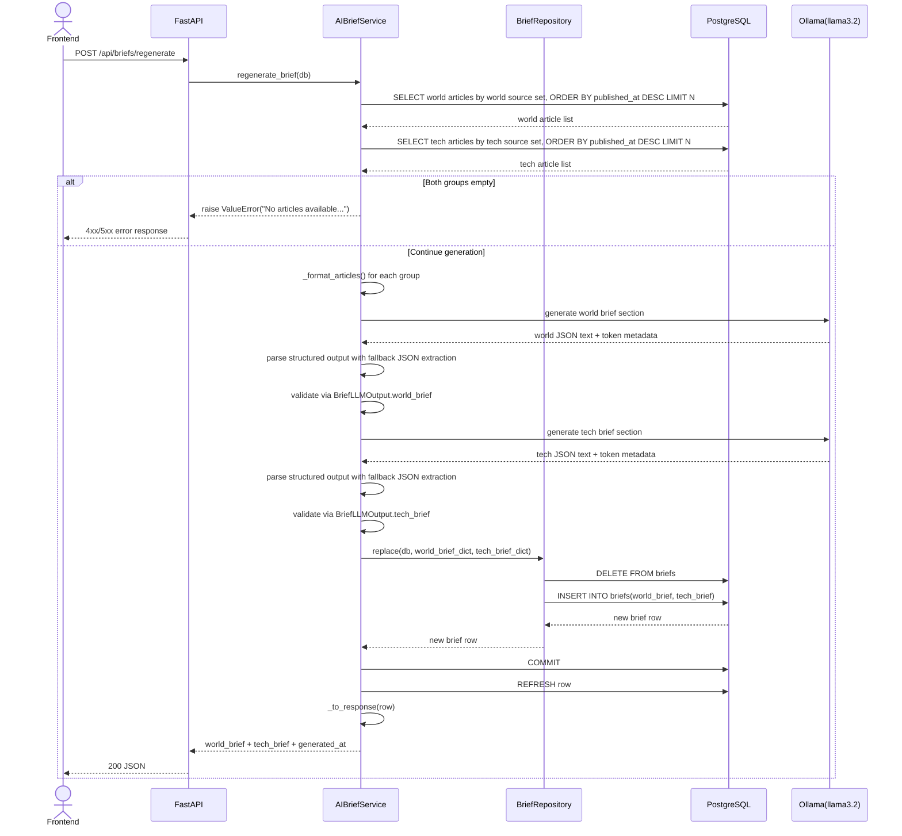
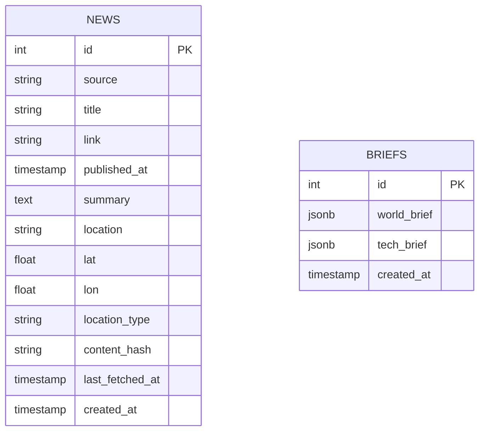

# AI Brief Service

## Purpose
This document describes the AI Brief generation system used in the World Monitor Intelligence Dashboard.

The system generates two types of AI summaries using an LLM:
- World Brief
- Tech Brief

The LLM runs locally on the server using:
- Ollama
- llama3.2 model

The backend is built with FastAPI and uses LangChain for prompt templates and LLM interaction.

## 1. Brief Types

### World Brief
Purpose:
Provide a high-level overview of the most important global developments from recent news articles.

Example output:

World Brief - March 12, 2026

Key Developments
- Escalation continues in the Iran-Israel conflict with reports of Iranian mine activity in the Strait of Hormuz.
- Chile's new conservative president signals a regional shift toward right-wing political alignment.
- AI startup Rox reached a $1.2B valuation, reflecting continued investor interest in AI automation.

Regional Highlights

Americas
Political shifts in Chile indicate a growing conservative trend in parts of Latin America.

Middle East
Military tensions continue between Iran and Israel with airstrikes reported in Tehran and Beirut.

Africa
Eswatini confirmed receiving deportees under a controversial agreement with the United States.

Emerging Trends
Global headlines indicate rising geopolitical tensions while technology investment remains strong.

### Tech Brief
Purpose:
Focus on technology, AI innovation, product launches, and digital infrastructure signals.

Example output:

Tech Brief - March 12, 2026

Major Developments
- AI startup Rox reached a $1.2B valuation as automation demand accelerated.
- New enterprise tooling releases highlighted stronger AI workflow integration.
- Semiconductor supply updates signaled continued strategic competition.

Technology Signals
- Venture funding continues to prioritize applied AI platforms.
- Enterprise buyers are shifting from pilots to production AI deployments.

Risk Outlook
Market concentration and infrastructure bottlenecks remain key risks to sustained growth.

## 2. Article Selection Strategy
After articles are stored in the database, the AI Brief service selects 20 recent articles.

Selection criteria:
- Ordered by published_at timestamp
- Filtered by trusted news sources
- Split into 2 source groups based on configured RSS sources
- Limited to 10 world articles + 10 tech articles

World source group:
- bbc_world
- cnn_world
- nytimes_world
- guardian_world
- nbc_top_stories
- abc_international
- financial_times

Tech source group:
- techcrunch
- wired
- sciencedaily

Example query:

```sql
SELECT title, summary, source, location
FROM news
WHERE source IN (
  'bbc_world', 'cnn_world', 'nytimes_world', 'guardian_world',
  'nbc_top_stories', 'abc_international', 'financial_times'
)
ORDER BY published_at DESC
LIMIT 10;

SELECT title, summary, source, location
FROM news
WHERE source IN ('techcrunch', 'wired', 'sciencedaily')
ORDER BY published_at DESC
LIMIT 10;
```

These 20 articles are then passed to the LLM in one brief-generation request.

## 3. LLM Prompt Templates
LangChain is used to build prompts.

The model used:
llama3.2 via Ollama

### World Brief Prompt
You are a geopolitical intelligence analyst.

Create a concise "World Brief" summarizing the most important global developments.

Instructions:
- Use only the provided news articles.
- Identify major global events.
- Group insights by region when possible.
- Write in an intelligence briefing style.
- Keep it concise.

Articles:
{articles}

Return output in structured JSON format.

### Tech Brief Prompt
You are a global technology intelligence analyst.

From the following news articles create a "Tech Brief".

Focus on:
- AI innovation
- product and platform launches
- digital infrastructure and semiconductor signals
- technology market direction

Articles:
{articles}

Return the result in structured JSON format.

## 4. Structured LLM Output
The LLM must return structured JSON so the frontend can easily render the briefs.

Example response:

```json
{
  "world_brief": {
    "key_developments": [
      "Iran war escalation continues",
      "Chile shifts politically toward conservative leadership",
      "AI startup Rox reaches $1.2B valuation"
    ],
    "regional_highlights": {
      "americas": "Chile political shift indicates regional trend",
      "middle_east": "Airstrikes reported in Iran and Lebanon",
      "africa": "Eswatini receives deportees from US"
    },
    "emerging_trends": "Geopolitical tensions rising while AI investment continues."
  },
  "tech_brief": {
    "major_developments": [
      "AI startup Rox reaches $1.2B valuation",
      "Enterprise AI tooling adoption accelerates",
      "Semiconductor competition remains strategic"
    ],
    "technology_signals": [
      "Applied AI investment remains strong",
      "Production AI deployments expanding"
    ],
    "risk_outlook": "Infrastructure bottlenecks and concentration risk remain elevated."
  }
}
```

## 5. AI Brief Generation Flow
When new articles are stored in the database, the AI Brief service is triggered.

Steps:
1. Fetch latest 10 world articles from world source group.
2. Fetch latest 10 tech articles from tech source group.
3. Format article lists into prompt-ready text for each group.
4. Call LLM for world brief section and parse/validate JSON.
5. Call LLM for tech brief section and parse/validate JSON.
6. Replace stored briefs in database and commit transaction.

## 6. Sequence Diagrams

### Brief Fetch Flow (GET /api/briefs)


### Brief Regeneration Flow (POST /api/briefs/regenerate)


## 7. Brief Storage Strategy
Briefs are stored in the database.

When new articles arrive:
- Old briefs are deleted.
- New briefs are generated and inserted.

Table example:

```sql
CREATE TABLE briefs (
    id SERIAL PRIMARY KEY,
    world_brief JSONB,
    tech_brief JSONB,
    created_at TIMESTAMP DEFAULT NOW()
);
```

### AI Brief DB Design Diagram


Update strategy:
- Use one database transaction for refresh.
- DELETE FROM briefs;
- INSERT new brief;
- COMMIT;

If INSERT fails, rollback is executed so previous committed data remains intact.

This ensures the dashboard always displays fresh intelligence summaries.

## 8. API Endpoints
Instead of separate endpoints for each brief type, both briefs are returned in one API call.

### Get AI Briefs
GET /api/briefs

Response:

```json
{
  "world_brief": {},
  "tech_brief": {},
  "generated_at": "2026-03-12T23:00:00"
}
```

### Regenerate Briefs
POST /api/briefs/regenerate

Purpose:
- Trigger LLM generation again.
- Replace existing briefs in the database.

Flow:
- Call AI Brief Service.
- Fetch latest articles.
- Call LLM.
- Delete old briefs.
- Insert new briefs.

## 9. LLM Integration Stack
Components used:

Backend
- FastAPI

Prompt management
- LangChain PromptTemplate

Model runtime
- Ollama

LLM model
- llama3.2

Database
- PostgreSQL
