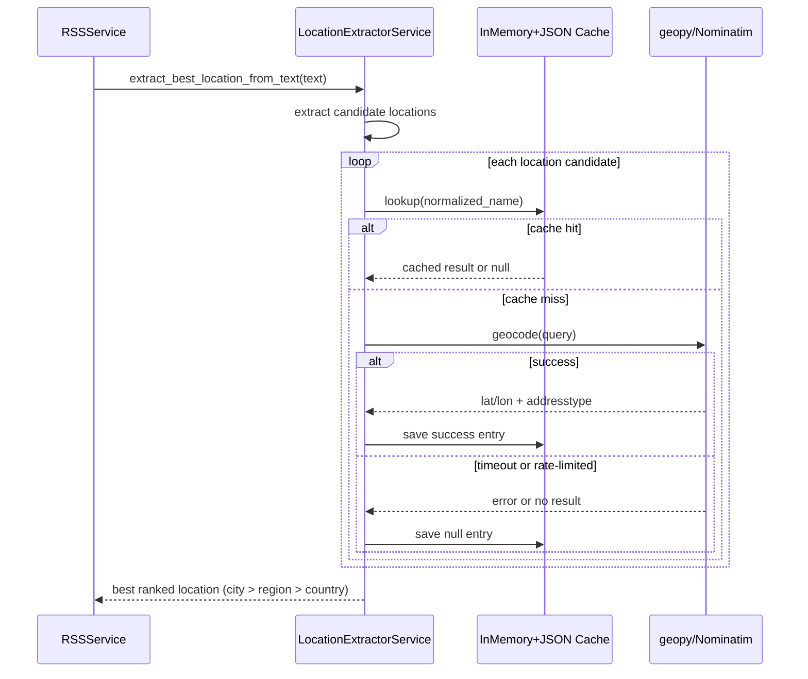

# Location Caching Strategy

## Purpose
This document describes how location geocoding is cached in the backend and why this strategy is used in the RSS enrichment pipeline.

## Why We Use Caching
- Reduce repeated geocoding calls for frequently mentioned places.
- Improve ingest latency by returning known locations from local storage.
- Increase resilience when upstream geocoding is slow or temporarily unavailable.
- Respect external service limits by reducing unnecessary requests.
- Keep location resolution consistent across ingestion runs.

## Rate Limiting We Faced
- During ingestion, repeated geocoding requests triggered geopy/Nominatim rate limiting.
- Caching reduced duplicate lookups, which lowered retry pressure and stabilized pipeline throughput.

## Current Strategy
- Cache file path: `backend/data/geocode_cache.json`.
- On service startup, cache entries are loaded into memory.
- Query keys are normalized before lookup (for example, US -> United States).
- In-memory cache is checked first; cache hit returns immediately.
- Cache miss triggers a geocode call through rate-limited Nominatim via geopy.
- Both successful results and failed lookups (`null`) are persisted to disk.
- A thread lock guards concurrent reads and writes to the shared cache map.

## Cached Data Shape
- Success entry:
  - `name`
  - `lat`
  - `lon`
  - `type` (`city`, `region`, `country`)
  - `rank` (1 city, 2 region, 3 country)
- Failed lookup entry: `null`.

## Tradeoffs and Risks
- No TTL or eviction policy, so cache size can grow over time.
- `null` entries persist, so temporary failures can become long-lived misses.
- Cached values are not auto-refreshed, which can cause stale data.
- Under high parallel load, lock contention may increase latency.

## Future Improvements
- Add TTL-based refresh for stale entries.
- Add size limits or LRU-style eviction.
- Distinguish temporary failures from permanent not-found results.
- Add cache metrics (hit rate, miss rate, null-hit rate).

## Sequence Diagram

## Related Documents
- [News RSS Pipeline](news-pipeline.md)
- [News API Flow](news-api-flow.md)
