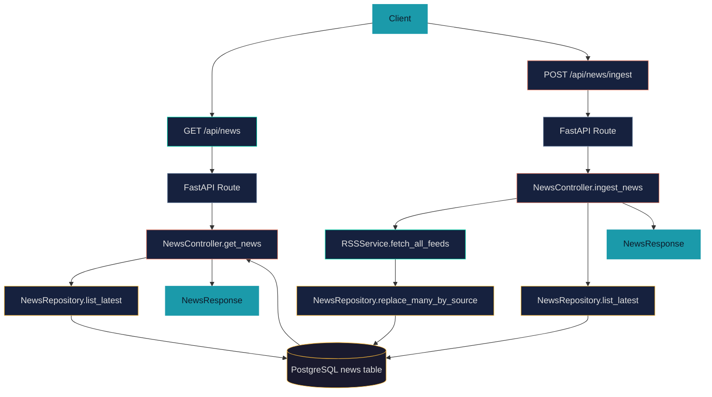
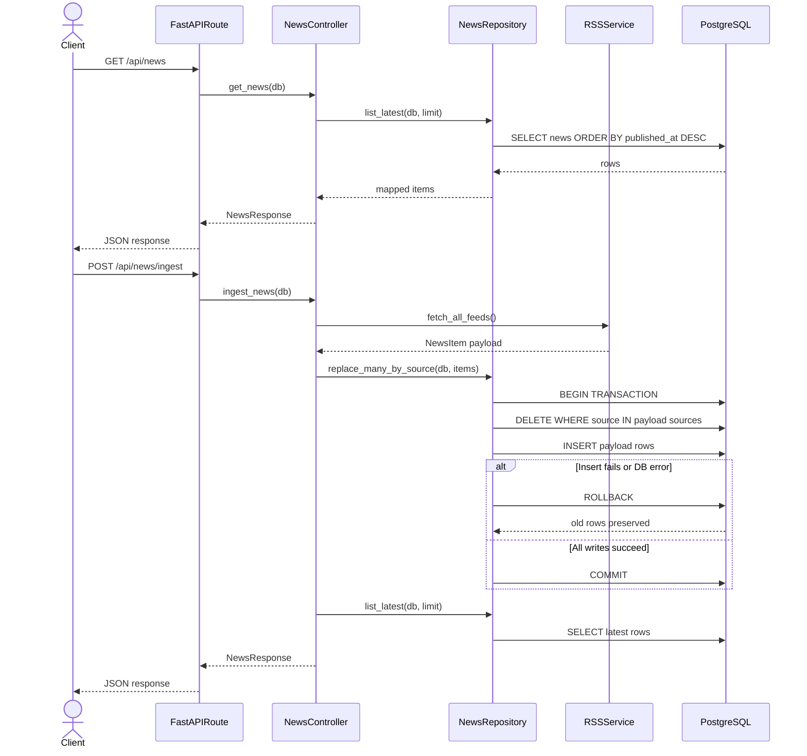

# News API Flow

## Purpose
This document describes endpoint orchestration for reading and ingesting news through the API layer.

For RSS internals (fetch, parse, normalize, enrich), see [news-pipeline.md](news-pipeline.md).
For persistence structure, see [../system-arch/database.md](../system-arch/database.md).

## Endpoints
- `GET /api/news`: read latest persisted news from the `news` cache table.
- `POST /api/news/ingest`: run ingest pipeline and return latest persisted news.

## Runtime Flows

### Read Flow (`GET /api/news`)
1. Client calls `GET /api/news`.
2. `routes/api.py` delegates to `NewsController.get_news(db)`.
3. Controller reads rows through `NewsRepository.list_latest(...)`.
4. Repository queries `news` ordered by `published_at`.
5. Controller maps rows to `NewsItem` and returns `NewsResponse`.

### Ingest Flow (`POST /api/news/ingest`)
1. Client calls `POST /api/news/ingest`.
2. `routes/api.py` delegates to `NewsController.ingest_news(db)`.
3. Controller calls `RSSService.fetch_all_feeds()`.
4. RSS pipeline returns normalized `NewsItem` payload.
5. Controller calls `NewsRepository.replace_many_by_source(...)`.
6. Repository opens one DB transaction and performs source-scoped `DELETE` + `INSERT`.
7. If any write fails, transaction rolls back so old rows stay intact.
8. If payload is empty, repository skips write operations.
9. Controller reads latest rows via `NewsRepository.list_latest(...)`.
10. Controller returns `NewsResponse`.

## Guarantees
- `GET /api/news` never triggers live RSS fetching.
- `POST /api/news/ingest` is currently synchronous.
- Empty ingest payload does not delete existing rows.
- Ingest replacement is source-scoped, not full-table replacement.
- Source-scoped delete+insert runs in one transaction (all-or-nothing).

## Flowchart

## Sequence Diagram

