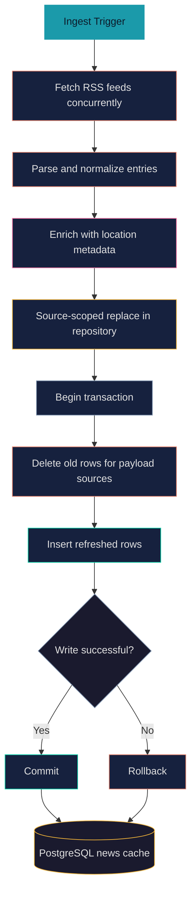
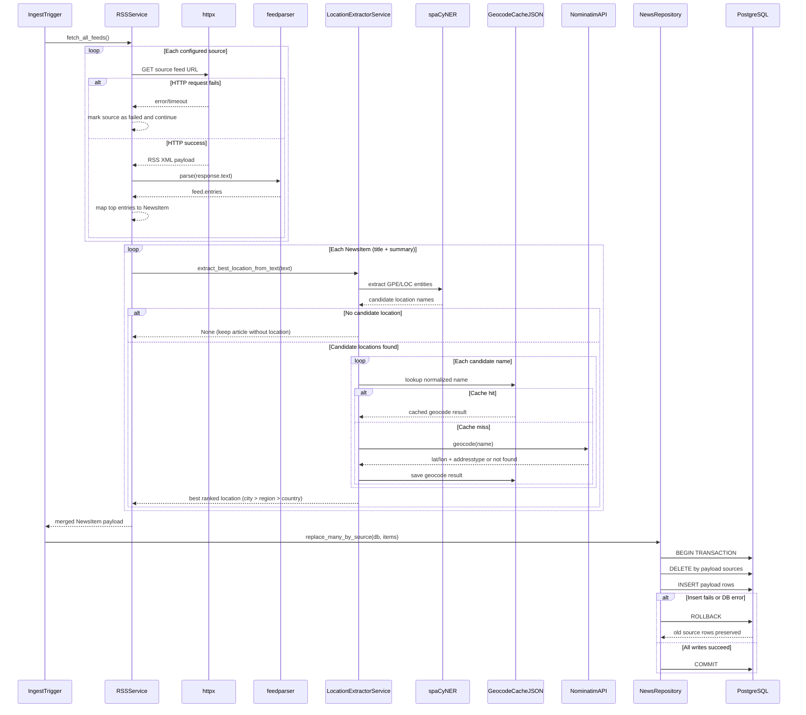

# News RSS Pipeline

## Purpose
This document describes only the RSS ingestion pipeline that fetches, normalizes, enriches, and prepares news items for persistence.

For endpoint orchestration (`GET /api/news` and `POST /api/news/ingest`), see [news-api-flow.md](news-api-flow.md).
For location geocode cache design and rationale, see [location-caching-strategy.md](location-caching-strategy.md).

## Pipeline Scope
- Trigger: ingestion path invokes `RSSService.fetch_all_feeds()`.
- Input: configured RSS feed URLs.
- Output: normalized `NewsItem` collection passed to `NewsRepository.replace_many_by_source(...)`.
- Storage target: `news` table described in [../system-arch/database.md](../system-arch/database.md).

## Runtime Pipeline
1. `RSSService` loads configured feed sources.
2. Feeds are fetched concurrently with `httpx`.
3. Raw feed payloads are parsed with `feedparser`.
4. Feed entries are normalized into internal `NewsItem` shape.
5. Location extraction enriches items with `location`, `lat`, `lon`, and `location_type` when available.
6. Service returns the merged `NewsItem` payload to the caller for repository persistence.

## Important Behavior
- Pipeline execution is synchronous in the current architecture.
- Failures are isolated per feed/item so successful items can still continue through the pipeline.
- Source identity is preserved so persistence can run source-scoped replacement.
- Existing news rows are treated as a cache snapshot. Refresh uses a single transaction for source-scoped delete+insert so changes are applied atomically.
- Replacement is intentionally source-scoped (not full-table) because some sources may fail during a fetch cycle; keeping untouched sources avoids dropping still-valid cached news.
- If pipeline output is empty, persistence layer skips delete/insert and existing cached rows remain.

## Flowchart

## Flow Summary
- The ingest trigger starts a concurrent fetch across configured RSS sources.
- The pipeline parses feed entries and normalizes them into `NewsItem`.
- Location enrichment adds best-effort geo fields when available.
- Persistence replaces only payload sources inside one DB transaction.
- On any write failure, rollback preserves the previous cached state.

## Sequence Diagram

