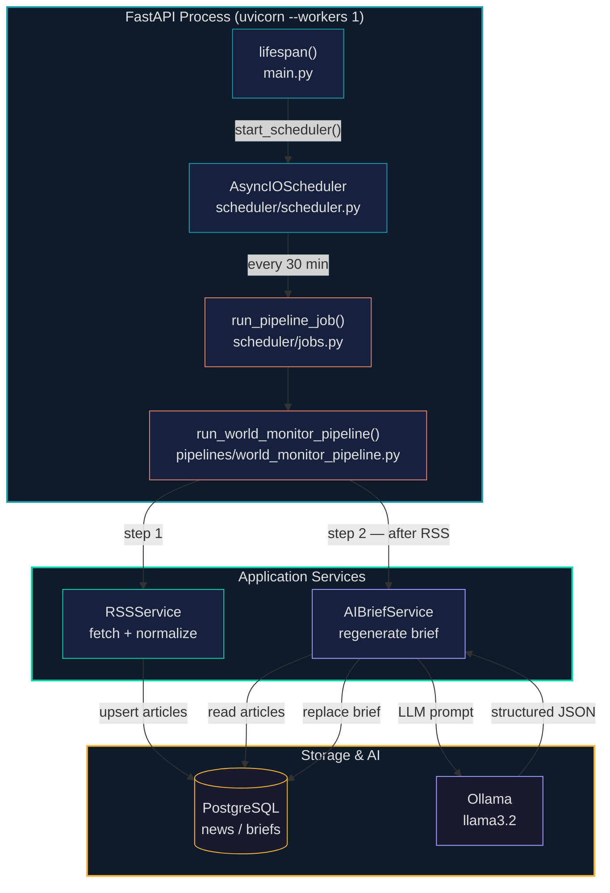
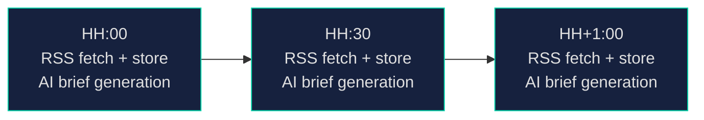
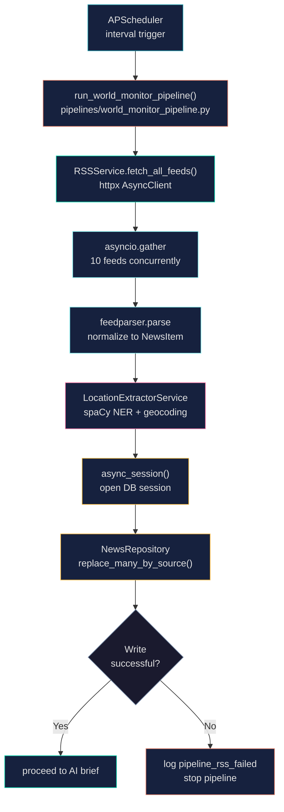
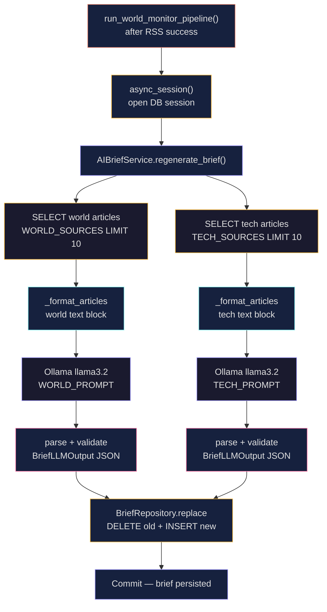
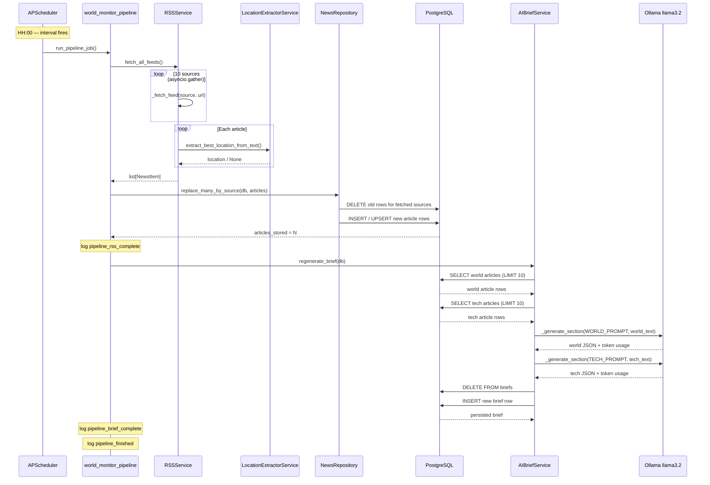

# Scheduled Tasks

## Purpose
This document describes the periodic scheduling layer for World Monitor — how background tasks are triggered, what each task does, and how the components fit together.

For the RSS ingestion pipeline internals, see [news-pipeline.md](news-pipeline.md).
For the AI brief generation internals, see [ai-brief-service.md](ai-brief-service.md).

---

## 1. Component Architecture

APScheduler runs inside the FastAPI process. On startup the lifespan hook registers one interval job that fires the pipeline directly — no broker, no separate worker process, no Redis.



---

## 2. Schedule

One job runs the full pipeline sequentially every 30 minutes. RSS ingestion always completes before brief generation begins.

| Job ID | Trigger | Interval | Overlap policy |
|:-------|:--------|:---------|:---------------|
| `world_monitor_pipeline` | `interval` | 30 minutes | `max_instances=1` — skips if previous run is still active |

`coalesce=True` — if the server was paused and multiple intervals were missed, only one catch-up run fires.



---

## 3. Pipeline Steps

### Step 1 — RSS Ingestion

**Called by:** `run_world_monitor_pipeline()` → `RSSService.fetch_all_feeds()` + `NewsRepository.replace_many_by_source()`



If RSS fails the pipeline logs `pipeline_rss_failed` and returns early — the brief step is skipped for that cycle.

---

### Step 2 — AI Brief Generation

**Called by:** `run_world_monitor_pipeline()` → `AIBriefService.regenerate_brief()` — only runs after RSS succeeds.



If brief generation fails the error is logged as `pipeline_brief_failed`. The scheduler is unaffected and will retry the full pipeline on the next interval.

---

## 4. Full Execution Sequence

End-to-end view of one 30-minute cycle.



---

## 5. File Structure

```
backend/
├── main.py                              # lifespan calls start_scheduler() / shutdown_scheduler()
│
├── scheduler/
│   ├── __init__.py
│   ├── scheduler.py                     # AsyncIOScheduler instance, start/shutdown helpers
│   └── jobs.py                          # run_pipeline_job() — thin async wrapper
│
├── pipelines/
│   ├── __init__.py
│   └── world_monitor_pipeline.py        # sequential RSS → AI brief orchestration
│
└── app/
    └── services/
        ├── rss_service.py               # feed fetching + location enrichment
        └── ai_brief_service.py          # LLM brief generation
```

---

## 6. Docker Setup

The scheduler runs inside the single `fastapi` service. No additional containers are needed.

| Service | Workers | Scheduler |
|:--------|:--------|:----------|
| `fastapi` | 1 (`--workers 1`) | APScheduler starts in the FastAPI lifespan |

`--workers 1` is required. Multiple Uvicorn workers would each start their own scheduler instance, causing duplicate pipeline runs every interval.

---

## 7. Configuration

| Variable | File | Default | Purpose |
|:---------|:-----|:--------|:--------|
| `APP_OLLAMA_BASE_URL` | `env/.env.fastapi` | `http://ollama:11434` | Ollama endpoint used by AIBriefService |
| `APP_OLLAMA_MODEL` | `env/.env.fastapi` | `llama3.2` | LLM model for brief generation |
| `APP_OLLAMA_TIMEOUT` | `env/.env.fastapi` | `120` | Seconds before LLM call times out |

Interval duration is set directly in `scheduler/scheduler.py` (`minutes=30`).

---

## 8. On-Demand Execution

Both pipeline steps are also triggerable on demand via HTTP without waiting for the schedule:

| HTTP Endpoint | Equivalent step |
|:--------------|:----------------|
| `POST /api/news/ingest` | RSS fetch + store |
| `POST /api/briefs/regenerate` | AI brief generation |
